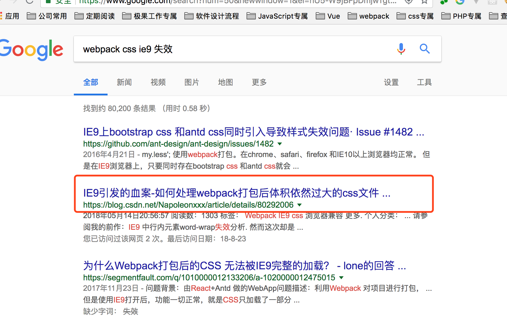

# vue+element UI做项目开发，在调试阶段发现部分css样式不生效，于是google了一下得到如下结果

## 忽然隐约想起以前很早之前看的一些文章，IE9浏览器好像对大尺寸的css有些约束，想到这一层，越想越觉得有道理，问题可能就出在这里。于是就这方面的问题google了一下，发现的确是这样。

Does IE9 have a file size limit for CSS? 
Microsoft Support
规则 (Rule) 如下，我就不翻译了：

- A sheet may contain up to 65534 rules
- A document may use up to 4095 stylesheets
- @import nesting is limited to 4095 levels (due to the 4095 stylesheet limit)

其实我有点不太确定怎么样算一条rule，还需要再深挖一下。但是我看的另一篇文章提到过IE9一个css文件中不能超过4000+ selectors.

[参考链接](https://blog.csdn.net/Napoleonxxx/article/details/80292006)
